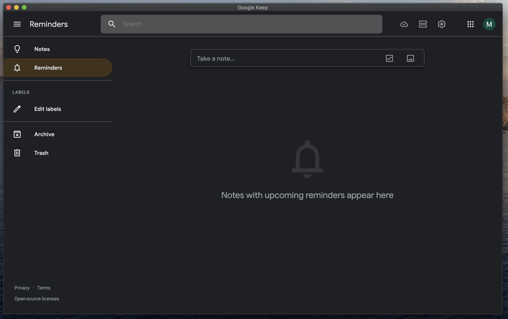

# Description

Cross-platform (MacOS, Windows, Linux) electron-powered desktop [Google Keep](https://keep.google.com) application.

Smooth scrolling, caches locally your account information. Enjoy!

Exists solely because of [Natifier](https://github.com/jiahaog/nativefier).

# Requirements

-   `Node.js` >= 12.13.0
-   `npm` >= 6.9.0

# How to build for your system

#### 1) `npm run bootstrap`

#### 2) Extract binary from generated `./bin` folder and install as ordinary binary

## Interface:

